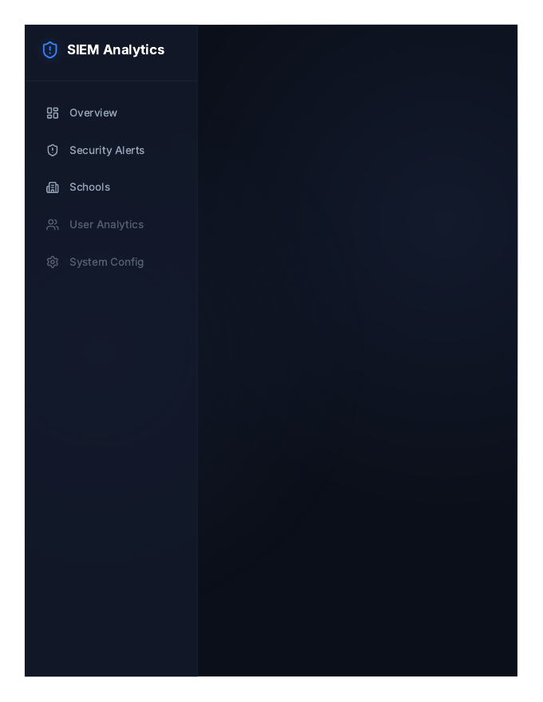

# SIEM Logs Analyzer

> ## Status: 🟡 In Progress
>
> <progress value="75" max="100"></progress>
> **Progress: 75%** — Dashboard UI complete and builds; depends on an external logs API

<p align="center">
  
</p>

[](https://react.dev/)
[](https://vite.dev/)
[](https://axios-http.com/)

## Screenshots

<p align="center">
  
  <br />
  <em>SIEM analytics dashboard.</em>
</p>


## What it is

A frontend analytics dashboard for monitoring school security/audit logs in one place. It connects to a school-backend API and shows login activity, security alerts, and per-school log breakdowns. Built for school IT admins who need a single view over login/security events across multiple schools.

## What works (verified)

- ✅ Project builds cleanly — `npm run build` succeeds (verified)
- ✅ Three routed pages: Dashboard Overview, Security Alerts, School Logs (verified by reading `App.jsx` routes)
- ✅ API layer with paged log fetching and filters (event type, school, role, action, category) — `src/api.js` (verified by code read)
- ✅ Sidebar navigation layout with main content area (verified by code read)

## Tech stack

| Layer | Tech |
|---|---|
| Framework | React 19 + Vite 8 |
| Routing | react-router-dom v7 |
| HTTP | Axios |
| Icons | lucide-react |
| Deploy | Vercel (`vercel.json` present) |

## How to run

```bash
npm install
npm run dev      # dev server → http://localhost:5173
npm run build    # production build → dist/
```

Configure the backend via `.env`:

```
VITE_API_URL=https://school-backend-eysq.onrender.com
VITE_LOGS_API_ENDPOINT=/api/logs
```

> The app needs the school-backend API (`/api/audit`, `/api/audit/schools`) to be reachable, otherwise the pages show fetch errors.

## Screenshots

No screenshots in the repo. The banner above is the visual. The UI is a dark sidebar + dashboard layout.

## What you can add more

- [ ] Fallback/demo mode with mock log data when the API is unreachable — makes the dashboard usable offline
- [ ] Real-time log streaming (WebSocket/SSE) for the "real-time" claim in the header
- [ ] Alert rules engine — let admins define thresholds (e.g. N failed logins) instead of only viewing
- [ ] Export logs to CSV/PDF for compliance reporting
- [ ] Auth on the dashboard itself (the API is currently called without auth headers)
- [ ] Tests — no test files exist yet

## Project structure

```
src/
├── App.jsx               # Routes: /, /alerts, /schools
├── main.jsx              # Entry point
├── api.js                # Axios calls to /api/audit*
├── components/
│   └── Sidebar.jsx       # Nav sidebar
├── pages/
│   ├── DashboardOverview.jsx
│   ├── SecurityAlerts.jsx
│   └── SchoolLogs.jsx
└── utils/
    └── logs.js           # Log helpers
```

---
*README written after code audit on 2026-10-08.*
